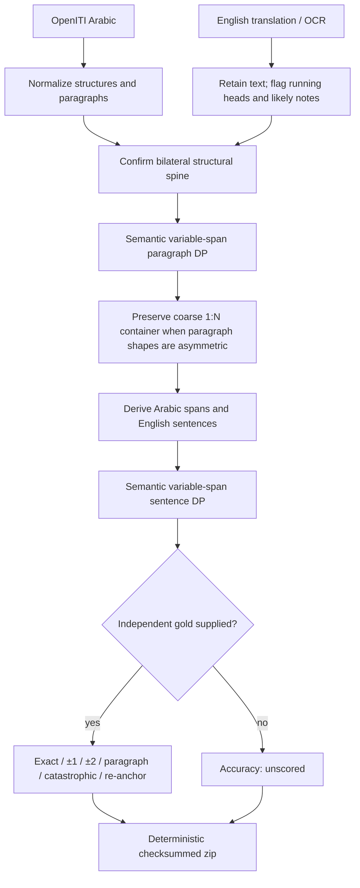

# Arabic–English alignment algorithm and reviewed Hamadhani results

**Review date:** 2026-08-17  
**Implementation:** `versed.align.bundle.v1`  
**Reviewed corpus:** al-Hamadhani's *Maqamat* (OpenITI Arabic) ↔ W. J.
Prendergast's English translation  
**Reviewed artifact:** `hamadhani-prendergast-reviewed-v4.zip`  
**Bundle ID:** `d4cab29b9c3bdae61d91c436cc78be1abbc062e866db0a4e603ef085e5eaec70`

## Executive verdict

The architecture is sound: it preserves structural, paragraph, and sentence
correspondence as separate objects; uses monotonic variable-span alignment;
refuses unsupported structural guesses; writes deterministic verifiable
archives; and never treats coverage as accuracy.

The Hamadhani structural alignment is strong: all 51 Arabic maqamat have 51
English counterparts, and every pair is independently confirmed by heading
transliteration or title evidence. The interior semantic alignment is useful
for review and buffered reading, but it is **not yet validated sentence-level
parallel data**. Random inspection found mostly correct local passages plus
some one-span drift and surviving OCR footnotes. No sentence accuracy
percentage should be published until independent gold is labeled.

The review found three material defects and corrected them:

1. OpenITI prose continued after a level-one `# |` heading could be silently
   dropped.
2. A confirmed section with one long Arabic paragraph and more than five
   English OCR paragraphs could not pass its full content to sentence
   alignment.
3. Semantic similarity could accept a grossly implausible length match.

After correction, the same random sample improved without changing the sampled
sections. Remaining problems are concentrated in nineteenth-century OCR note
separation and boundary precision, not book-level drift.

## What the tool produces

The tool does not flatten a translation into one English string per Arabic
block. It keeps four layers:

```text
work
└── structural link: Arabic maqama ↔ English maqama
    └── paragraph link: one or more Arabic paragraphs ↔ one or more English paragraphs
        └── sentence link: one or more Arabic spans ↔ one or more English sentences
            └── reader policy: sentence highlight / paragraph follow / section anchor
```

Every source paragraph and derived sentence has a stable ID and SHA-256 hash.
The output zip contains both documents, all three link layers, diagnostics,
accuracy results, and a payload-bound manifest.

## Algorithm

### 1. Normalize without losing hierarchy

Arabic OpenITI mARkdown is parsed into ordered structural units and paragraphs.
The English translation is converted into ordered paragraphs while retaining
suspected footnotes with audit flags. Normalized documents must share a
`work_id`; IDs and sequences must be unique and contiguous; paragraph hashes
must match their text.

Relevant code:

- `src/versed_translator/align/models.py`
- `src/versed_translator/align/io.py`
- `src/versed_translator/benchmark/sources/openiti_markdown.py`

### 2. Establish the bilateral structural spine

The maqama profile finds Arabic `المقامة` headings and English `THE MAQAMA OF
…` headings. Document order is the pairing key only after both sides expose the
same number of the same kind of unit.

The profile rejects the zip unless:

- Arabic and English unit counts are equal; and
- at least `max(3, ceil(25% × unit_count))` pairs independently confirm by
  transliteration, short-name evidence, or a known translated epithet.

For Hamadhani, the result is 51 Arabic units, 51 English units, and 51 confirmed
pairs; only 13 confirmations were required. Equal counts alone would not have
been accepted.

For a book without a bilateral spine, `build-text` emits an explicitly
low-confidence `whole_book_unanchored` container with `review_required`. It
does not pretend that execution proves correspondence.

Relevant code:

- `src/versed_translator/align/profiles.py:341`
- `src/versed_translator/benchmark/spine_align.py:199`
- `src/versed_translator/align/engine.py:61`

### 3. Quarantine likely OCR notes

The English adapter removes repeated running heads and marks likely scholarly
notes using high-precision cues such as explicit note markers, “literally,”
references, dictionaries, manuscript commentary, and explanatory thief/gloss
language. Very short fragments immediately following a detected note are also
quarantined.

Quarantine is non-destructive: all 1,167 suspected note paragraphs remain in
`documents/en.structures.jsonl` with `possible_footnote` and
`exclude_from_alignment`. They do not enter DP, but they can be audited or
reclassified later.

This remains heuristic. The OCR interleaves translation and notes in reading
order, and some notes survive while some short translation fragments may be
quarantined.

Relevant code: `src/versed_translator/align/profiles.py:77-130`.

### 4. Compute multilingual semantic evidence

The default semantic model is:

```text
sentence-transformers/paraphrase-multilingual-MiniLM-L12-v2
```

It runs locally through Transformers with `trust_remote_code=False`. Mean
pooled vectors are L2-normalized and cached by exact text.

For a proposed Arabic span `A` and English span `E`, the scorer is:

```text
score(A,E) = 2.4 × cosine(A,E)
           + 0.35 × heuristic(A,E)
           - 0.45 × |log(words(E) / (1.55 × words(A)))|
           - 1.0
```

The heuristic combines transliterated entity evidence, normalized numbers,
and length. Arabic-Indic numbers such as `٢١` are normalized before comparison
with `21`.

The length term is a prior, not a cut. It prevents topically similar but
grossly different spans from winning merely because their embeddings are
close.

Relevant code:

- `src/versed_translator/align/embeddings.py:63-98`
- `src/versed_translator/align/dp.py:62-87`

### 5. Align paragraphs with monotonic variable-span DP

Within each confirmed structural unit, dynamic programming finds the maximum
score monotonic path. Paragraph moves include:

```text
1:1  1:2  2:1  2:2  1:3  3:1  2:3  3:2
1:4  4:1  1:5  5:1  omission  addition
```

A small penalty favors thinner spans when two choices score equally. Semantic
runs use a lower omission/addition cost so obvious OCR notes can be skipped.

If a confirmed structural unit contains one paragraph on one side and more
than five on the other, the engine emits a coarse `1:N` paragraph container
instead of selecting an arbitrary five-paragraph slice. Sentence DP then sees
the entire structurally bounded section. This is essential for Rusafa, whose
Arabic is one 442-word paragraph while the OCR translation is split across
many paragraphs and notes.

Relevant code: `src/versed_translator/align/engine.py:28-43,181-222`.

### 6. Derive sentence spans without discarding paragraphs

English is split on terminal punctuation with abbreviation protection.
Arabic is split first on terminal punctuation. Classical paragraphs lacking
terminal punctuation are then divided into bounded clause spans at Arabic
commas and semicolons, with a target maximum of 55 words. These are derived
alignment spans; the original paragraph remains intact.

Sentence DP supports:

```text
1:1  1:2  2:1  2:2  1:3  3:1
1:4  4:1  1:5  5:1  omission  addition
```

The larger moves are needed when one long classical Arabic span corresponds
to several shorter English sentences.

Relevant code:

- `src/versed_translator/align/sentences.py`
- `src/versed_translator/align/engine.py:45-58,260-273`

### 7. Record uncertainty honestly; demote instead of widening without limit

Each link records operation, score-derived confidence, flags, and uncertainty
radius. The current confidence is an internal 0–1 ranking transform:

```text
confidence = clamp(0.5 + score / 4, 0.12, 0.97)
```

It is **not a calibrated probability**. A displayed `0.65` must not be read as
“65% likely correct.” Radius is derived from that same uncalibrated score, so
it is not independent evidence and must not be widened without a display
budget.

The reader bridge uses three provisional modes instead: a tight sentence
highlight only when the linked span plus radius fits a three-sentence budget;
paragraph follow when the link is coarse, low-signal, or over budget; and a
section anchor for unanchored/review-required correspondence. Mode 2 removes a
precision claim but can still point at the wrong paragraph; mode 3 is the
structural floor. See `docs/READER_ALIGNMENT_BRIDGE.md`.

Relevant code: `src/versed_translator/align/dp.py:174-200`.

### 8. Score only against independent gold

When stable-ID gold links are supplied, the scorer reports:

| Metric | Meaning |
| --- | --- |
| Exact | Predicted English IDs exactly equal the gold span |
| ±1 | Gold span lies inside the prediction widened by one sentence |
| ±2 | Gold span lies inside the prediction widened by two sentences |
| Paragraph correct | Prediction and gold overlap an English paragraph |
| Catastrophic | Prediction misses the gold paragraph entirely |
| Re-anchor distance | Arabic sentence distance from a miss to the next ±2 hit |

Without gold, the result is `unscored`. Coverage, structural confirmation, and
successful zip verification are never substituted for accuracy.

Relevant code: `src/versed_translator/align/metrics.py:20-148`.

### 9. Write a deterministic portable archive

The writer uses fixed member names and timestamps, sorted compact JSON,
SHA-256 for every payload, and atomic replacement. The bundle ID covers the
source hashes and every payload hash, so changing the alignment changes the
identity.

The verifier rejects duplicate, undeclared, unsafe, oversized,
size-mismatched, checksum-mismatched, and identity-mismatched members. It
streams payload hashing and checks uncompressed sizes before reading members.
The manifest explicitly says `rights_policy: not_evaluated_by_aligner`.

Relevant code: `src/versed_translator/align/bundle.py:97-250`.

## End-to-end flow



## Test evidence

Commands run from the repository root:

```bash
uv run pytest -q

uv run ruff check \
  src/versed_translator/align/__init__.py \
  src/versed_translator/align/__main__.py \
  src/versed_translator/align/bundle.py \
  src/versed_translator/align/dp.py \
  src/versed_translator/align/embeddings.py \
  src/versed_translator/align/engine.py \
  src/versed_translator/align/io.py \
  src/versed_translator/align/metrics.py \
  src/versed_translator/align/models.py \
  src/versed_translator/align/profiles.py \
  src/versed_translator/align/sentences.py \
  src/versed_translator/benchmark/sources/openiti_markdown.py \
  tests/test_align_bundle.py tests/test_align_profiles.py \
  tests/test_align_dp.py tests/test_openiti_sources.py

uv run versed-align verify \
  ~/versed-translator-data/aligned/hamadhani-prendergast-reviewed-v4.zip
```

Observed results:

| Check | Result |
| --- | ---: |
| Full test suite | **517 passed**, 24 skipped |
| Targeted lint | **Passed** |
| Real bundle verification | **Passed** |
| Structural count/confirmation | **51 / 51** |
| Deterministic bundle test | Passed |
| Tamper/undeclared-member rejection | Passed |
| Overlapping structural-link rejection | Passed |
| Oversized DP-window rejection | Passed |
| OpenITI `# |` continuation regression | Passed |
| Asymmetric `1:N` section regression | Passed |
| Arabic-Indic number normalization | Passed |
| Unreachable DP move-set rejection | Passed |

The 24 skips are optional or external integration tests, not failures.

## Real Hamadhani bundle results

| Field | Result |
| --- | ---: |
| Arabic structural units | 51 |
| English structural units | 51 |
| Sequence pairs | 51 |
| Independently confirmed structural pairs | **51** |
| Required confirmations | 13 |
| Paragraph links | 483 |
| Sentence links | 1,500 |
| Arabic alignable paragraph coverage | 100% |
| English alignable paragraph coverage | 100% |
| Suspected English footnote paragraphs retained but excluded | 1,167 |
| English total paragraph coverage after exclusions | 52.8485% |
| Accuracy status | **Unscored** |

The 100% alignable coverage says every paragraph admitted to DP appears in the
path. It does not say the path is correct. The 52.8485% total-English figure
includes the quarantined OCR notes in the denominator.

## Reproducible random sample

The sample was selected before the corrective review from the first semantic
bundle. It was not changed after failures appeared:

```python
seed = "b3813cf2669727d30f2bb0c2f028504a1f940dd5ba0d94db4272453ba4641d81"
indices = sorted(random.Random(seed).sample(range(51), 3))
# [12, 27, 29] zero-based: maqamat 13, 28, and 30
```

Thus the reviewed sections are Basra, ʿIraq, and Rusafa. Excerpts below are
verbatim bundle text; ellipses only shorten display.

### Random section 13: Basra

Structural link:

```text
ar:u0013  ( المقامة البصرية )
    ↕ bilateral_maqama_sequence; confirmation=translit; confidence=.98
en:u0013  BASRA
```

First reviewed sentence link:

```text
operation: 1→3    confidence: .470 (uncalibrated)    radius: ±2
Arabic ID:  ar:u0013:p0000:s0000
English IDs: en:u0013:p0000:s0000,
             en:u0013:p0008:s0000,
             en:u0013:p0008:s0001
```

> **Arabic:** حدثني عيسى بن هشام قال: دخلت البصرة وأنا من سني في
> فتاء، ومن الزي في حبر ووشاء، ومن الغنى في بقر وشاء، فأتيت المربد في
> رفقة تأخذهم العيون …
>
> **English:** “Isa ibn Hisham related to us and said: I entered Basra
> when, as regards age, I was in the prime of youth; as to attire, I was
> clad in the variegated striped stuffs of Yemen … matter of wealth, I had
> cattle and sheep. And I came to Mirbad with some friends …”

Review: correct local passage and sensible `1→3` split. The next two links
continue through the gaming party, the approaching figure, and the greeting in
order. A later Basra span still admits an OCR note, so the section is usable
with a buffer but not clean parallel data.

### Random section 28: ʿIraq

Structural link:

```text
ar:u0028  ( المقامة العراقية )
    ↕ bilateral_maqama_sequence; confirmation=short_or_qaf; confidence=.98
en:u0028  ‘IRAQ
```

First reviewed sentence link:

```text
operation: 1→3    confidence: .435 (uncalibrated)    radius: ±2
Arabic ID:  ar:u0028:p0000:s0000
English IDs: en:u0028:p0000:s0000..s0002
```

> **Arabic:** حدثنا عيسى بن هشام قال: طفت الآفاق، حتى بلغت العراق،
> وتصفحت دواوين الشعراء … وأحلتني بغداد فبينما أنا على الشط إذ عن لي
> فتى في أطمار، يسأل الناس ويحرمونه …
>
> **English:** “‘Isa ibn Hisham related to us and said: I travelled about
> the world till I reached ‘Iraq. I had turned over the pages of the diwans
> of the poets … And I alighted at Baghdad. Now, while I was on the river
> bank, there suddenly appeared before me a youth in worn-out garments …”

Review: correct passage and correct order. This opening was absent before the
OpenITI continuation fix. The following two predictions are locally shifted:
the Arabic origin/language questions attach to the English approach and origin
sentences. They are inside the intended local caption neighborhood but are not
exact boundaries.

### Random section 30: Rusafa

Structural and paragraph links:

```text
ar:u0030  ( المقامة الرصافية )
    ↕ bilateral_maqama_sequence; confirmation=translit; confidence=.98
en:u0030  RUSAFA

paragraph container: 1→14
flag: coarse_asymmetric_paragraph_container
```

First reviewed sentence link:

```text
operation: 1→4    confidence: .396 (uncalibrated)    radius: ±2
Arabic ID:  ar:u0030:p0000:s0000
English IDs: en:u0030:p0000:s0000,
             en:u0030:p0000:s0001,
             en:u0030:p0009:s0000,
             en:u0030:p0009:s0001
```

> **Arabic:** حدثنا عيسى بن هشام قال: خرجت من الرصافة أريد دار
> الخلافة، وحمارة القيظ تغلي بصدر الغيظ … فملت إلى مسجد قد أخذ من كل
> حسن سره وفيه قوم يتأملون سقوفه … وأداهم عجز الحديث إلى ذكر اللصوص
> وحيلهم والطرارين وعملهم …
>
> **English:** “‘Isa ibn Hisham related to us and said: I sallied forth
> from Rusafa to go to the capital … the heat became intense, patience
> failed me and so I turned towards a masjid … And in it there were people
> contemplating its ceilings … Finally the discussion led them to the
> mentioning of thieves and their artifices …”

Review: the opening is correct. The next `2→2` link correctly recovers the long
catalogue of thieves across English OCR page breaks. The third displayed link
begins with an explanatory footnote before returning to the correct
translation. Rusafa demonstrates both the value of the asymmetric container
and the remaining note-separation problem.

## Before/after review

| Area | Before review | Reviewed v4 |
| --- | --- | --- |
| ʿIraq opening | Silently lost after a `# |` heading | Recovered and aligned to the English opening |
| Long Arabic prose | Often one 100–400 word “sentence” | Bounded punctuation-derived spans, original paragraph retained |
| Highly asymmetric section | Paragraph DP could see at most five target paragraphs | Full coarse `1:N` container reaches sentence DP |
| Gross length mismatch | Weakly discouraged | Explicit logarithmic length penalty |
| Rusafa first match | Began in the middle of the thieves list/footnotes | Begins at the correct Rusafa narrative opening |
| DP impossible path | Could return a partial path silently for a custom move set | Raises a terminal-cell error |
| Arabic-Indic numbers | `٢١` did not equal `21` | Unicode digits normalized |

## Architecture and code review

### Strengths

- **Clear boundaries:** normalization/profile logic, alignment, metrics, and
  bundling are separate modules.
- **Correct object model:** structural, paragraph, and sentence links coexist;
  none is flattened into another.
- **Monotonicity:** the DP cannot teleport backward through the translation.
- **Fail-loud contracts:** count mismatch, weak structural evidence, oversized
  DP windows, overlapping maps, invalid IDs/hashes, and corrupt archives are
  rejected.
- **Auditability:** exclusions remain in the source document, every payload is
  hashed, and random samples are reproducible.
- **Rights neutrality:** alignment does not decide publication or ownership.
- **Security:** bounded inputs and DP cells, no pickle/deserialization, remote
  model code disabled, safe fixed zip members, streamed verification.

### Findings and recommendations

#### Active finding 1

- **Location:** `src/versed_translator/align/profiles.py:77-130`
- **Category:** scope
- **Severity:** major
- **Title:** OCR note separation is still heuristic
- **Description:** Random Rusafa inspection found an explanatory footnote
  inside an otherwise correct translation span. Text-only regexes cannot fully
  reconstruct a two-zone printed page after OCR has interleaved body and notes.
- **Suggestion:** add a layout-aware adapter from ALTO/hOCR/PDF coordinates or
  a page-level body/note classifier. Retain the current text heuristic as a
  fallback and preserve all excluded material for audit.

#### Active finding 2

- **Location:** `src/versed_translator/align/metrics.py:20-148`
- **Category:** scope
- **Severity:** major
- **Title:** No independent Hamadhani sentence gold
- **Description:** The bundle can report structural evidence and coverage, but
  exact/±1/±2/catastrophic accuracy remains unknown. Manual random review is
  evidence of behavior, not a percentage.
- **Suggestion:** label at least 50–100 stable-ID links sampled across at least
  ten maqamat, including prose, verse, notes, long paragraphs, and omissions.
  Freeze that gold before further parameter tuning.

#### Active finding 3

- **Location:** `src/versed_translator/align/dp.py:174-200`
- **Category:** scope
- **Severity:** major
- **Title:** Confidence is not calibrated
- **Description:** The score-to-confidence transform is monotonic but does not
  estimate empirical correctness. Consumers may misread values as
  probabilities.
- **Suggestion:** the reader bridge already renames the value
  `score_confidence`. Fit mode-selection thresholds against the stratified
  rendered pilot at matched precision; do not treat radius as independent
  safety evidence.

#### Active finding 4

- **Location:** `src/versed_translator/align/dp.py:10`
- **Category:** scope
- **Severity:** minor
- **Title:** Core alignment depends on a benchmark namespace
- **Description:** Production DP imports transliteration scoring from
  `benchmark.sources.translit`, reversing the desired dependency direction.
- **Suggestion:** move transliteration primitives into a neutral core module or
  inject the heuristic scorer. This is maintainability debt, not a current
  correctness failure.

#### Active finding 5

- **Location:** `src/versed_translator/align/dp.py:136-148`
- **Category:** scope
- **Severity:** minor
- **Title:** DP uses quadratic memory inside each window
- **Description:** The cell limit prevents unbounded work, but the full score
  and predecessor matrices are still `O(nm)` memory. Raising `--max-cells`
  casually can be expensive.
- **Suggestion:** keep the current hard limit. If genuinely large unanchored
  books become common, use banded DP or divide them with evidence-backed
  anchors rather than simply increasing the limit.

### Resolved during this review

#### Resolved finding A

- **Location:** `src/versed_translator/benchmark/sources/openiti_markdown.py:236-255`
- **Category:** scope
- **Severity:** major
- **Title:** Level-one heading continuations lost opening prose
- **Resolution:** a `# |` heading followed by `~~` now also becomes a paragraph,
  preserving the opening while retaining the structural heading.

#### Resolved finding B

- **Location:** `src/versed_translator/align/engine.py:181-222`
- **Category:** scope
- **Severity:** major
- **Title:** `1→5` paragraph cap discarded most of asymmetric sections
- **Resolution:** confirmed units with one paragraph versus more than five now
  emit a complete coarse container and pass the full interior to sentence DP.

#### Resolved finding C

- **Location:** `src/versed_translator/align/embeddings.py:89-98`
- **Category:** scope
- **Severity:** major
- **Title:** Semantic scorer accepted gross length mismatch
- **Resolution:** added an explicit log-ratio length penalty and regression
  inspection on the unchanged random sample.

## Final assessment

| Dimension | Grade | Reason |
| --- | --- | --- |
| Architecture/boundaries | Good | Clear adapters, engine, metrics, and archive contracts |
| Structural alignment | Strong on Hamadhani | 51/51 bilateral units independently confirmed |
| Paragraph preservation | Good | Original hierarchy retained; coarse asymmetry explicit |
| Sentence/passage usability | Promising, reviewable | Random openings are locally correct; some one-span drift |
| OCR resilience | Incomplete | Footnote leakage remains in difficult pages |
| Accuracy evidence | Insufficient | No independent sentence gold yet |
| Security/auditability | Good | Bounded, deterministic, checksummed, no rights inference |
| Production readiness | Reader integration ready behind a flag | Three-mode bridge exists; timed pilot still gates launch |

The algorithm is now a good foundation and a useful candidate aligner. The
offline ID bridge maps all 948/948 lexical Hamadhani alignment sentences onto a
fresh real Versed OpenITI ledger and emits structurally clamped three-mode
reader payloads when timings exist. That is enough to build the reader
integration behind a flag, not enough to auto-publish exact sentence-level
translations or release training-quality parallel data without independent
gold and a review gate.
